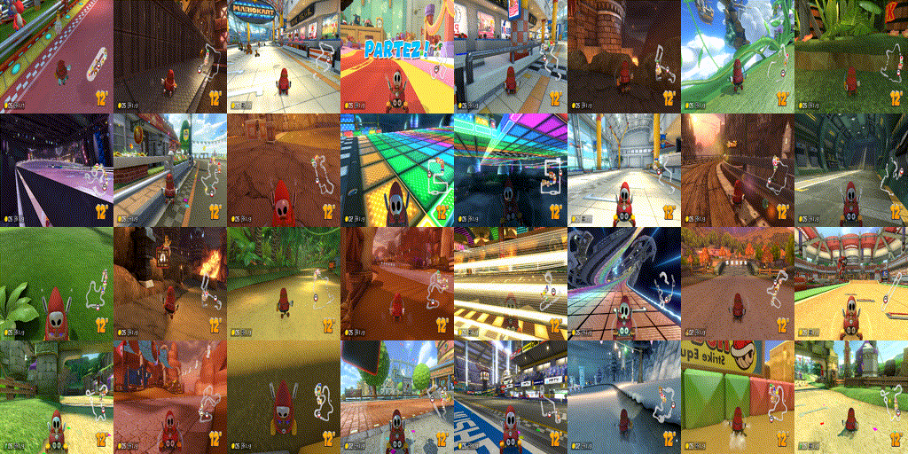
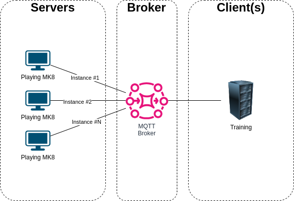
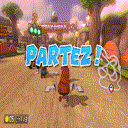

# MarioKart8-Gym-Env
Un entorno de OpenAI Gym para MarioKart8 que hace viables los proyectos de aprendizaje por refuerzo (RL). Este proyecto está destinado a fines de investigación.

Este proyecto permite lanzar varias instancias de Mario Kart 8 Deluxe (emulado por Yuzu) encapsuladas en un entorno de OpenAI gym.

Esto permite entrenar un agente de RL a partir de una imagen RGB con un tamaño cuadrado de 128px.

Este proyecto puede servir como base para añadir otros juegos de Switch también.

Este proyecto fue completado en 03/2023 inicialmente como un proyecto personal. Logré entrenar un agente que venció a la CPU más difícil en menos de 25M pasos de entrenamiento.
El agente de RL se puede encontrar en https://github.com/0xlouis/MarioKart8-Dreamer. El agente utiliza una imagen RGB de 128px como entrada y produce una salida de controlador de XBox.

# Descripción general de la arquitectura

La arquitectura está diseñada para permitir una gran flexibilidad en las opciones de despliegue: es totalmente posible ejecutar todo en una sola máquina, pero también es posible escalar el sistema.



Los `Servers` inician y ponen a disposición los datos requeridos para el entrenamiento, así como el vector de control que permite el control remoto del juego. Todas las interacciones se realizan a través de un broker MQTT.

El `Broker` simplifica la configuración técnica de los intercambios remotos, proporcionando una estructura fácil de interpretar y depurar.

El `Cliente(s)` se suscribe al broker para interactuar con las instancias del juego.

## Árbol de archivos

Aquí hay una descripción rápida del propósito de cada archivo:
* `src/server_launcher.py` : Este script se utiliza para ejecutar una instancia del servidor permanentemente. Esto es útil para fines de entrenamiento, para garantizar la inmunidad contra cierres inesperados del emulador o errores internos. Este es el archivo que debe ejecutar si desea iniciar una instancia del juego.
* `src/server.py` : Ejecuta una instancia del juego: configura gdb, lanza yuzu con mariokart y pone el juego en un estado listo para jugar. No debe ejecutar este archivo directamente con python. Use `src/server_launcher.py` en su lugar.
* `src/gym_mk8.py` : Contiene el entorno de gym de Mario Kart 8 Deluxe. La clase `EnvMarioKart8` es la que debe usar / personalizar para su agente de RL.
* `src/client.py` : Contiene el cliente MQTT de bajo nivel utilizado por la clase `EnvMarioKart8`.
* `src/common.py` : Contiene todas las estructuras comunes (protocolo, características del juego, etc.).
* `src/platform_specific.py` : Contiene interfaces para crear un controlador de XBox virtual y proporciona una interfaz para recuperar imágenes RGB del juego. La forma de realizar estas dos operaciones es muy específica de la plataforma (GNU/Linux, Windows).
* `src/joystic.py` : Utilizado para depuración. Lee el estado de un controlador real y produce un vector de acción de gym a partir de este estado.

# Requisitos

En el momento en que realicé el entrenamiento, contaba con:
* yuzu 1389 (2023-03-31)
* Mario Kart 8 Deluxe 1.7.1 (versión Fr/UE)
* GDB para ARM con soporte para python 3.8.10.

Proporcionaré algunos consejos en la sección `Configuración paso a paso` para obtener algunos de ellos.

## Nota importante sobre el juego

Dado que las funciones de recompensa del juego se obtienen leyendo el estado del juego a un nivel muy bajo, es importante utilizar la misma versión del juego que la mía (no sé si la región cambia algo). De lo contrario, es muy probable que la dirección de código/memoria no esté en el mismo lugar.

Si no puede obtener esta versión exacta, o si no sabe cómo actualizar el código fuente para tener en cuenta su versión, es un "NO GO" para el aprendizaje: el proyecto no podrá producir la recompensa y no podrá utilizar el menú del juego de forma autónoma.

# Configuración paso a paso

En esta sección, intentaré resumir todos los pasos que debe completar para obtener una configuración de aplicación funcional.

En mi caso, tanto los Clientes como los Servidores se ejecutaban bajo un sistema GNU/Linux (KUbuntu 22.04.1 LTS). Sin embargo, Windows está soportado teóricamente. Como anécdota, al principio del proyecto, los clientes se ejecutaban en Windows 10 porque ingenuamente pensé que Windows tendría un mejor soporte de controladores de GPU para ejecutar el juego. Pero de hecho me equivoqué, obtuve un mejor rendimiento en GNU/Linux. Como resultado, NUNCA he usado Windows para entrenar un agente y no sé si el soporte de Windows es funcional o no. Sé que Windows 11 NO está soportado (porque Microsoft rompió su compatibilidad de API de win10 a win11).

## Configuración de Yuzu

### Obtener Yuzu
Para obtener la misma versión que la mía, vaya a la página: https://github.com/yuzu-emu/yuzu-mainline/releases/tag/mainline-0-1389 y descargue `
yuzu-mainline-20230331-f047ba3bc.AppImage`

Nota: En principio, puede tomar la versión más reciente, a menos que algo se haya roto con el tiempo.

Ahora, tiene que extraer el contenido del AppImage en una carpeta local:
``` bash
chmod +x yuzu-mainline-20230331-f047ba3bc.AppImage
./yuzu-mainline-20230331-f047ba3bc.AppImage --appimage-extract
```
Esto creará la carpeta `squashfs-root`. Mueva esta carpeta a `emulator` y renómbrela como `yuzu`. Al final, el ejecutable principal de yuzu debe estar ubicado en `{project_root_folder}/emulator/yuzu/AppRun`. 

Ejecútelo (`./emulator/yuzu/AppRun`).

### Configurar Yuzu
Si nunca ha iniciado Yuzu antes, se le pedirá que utilice su Switch para que el emulador funcione. En ese caso, vaya a https://yuzu-emu.org/help/quickstart/ y siga las instrucciones.

En este punto, debería ver la ventana principal de yuzu. Y su emulador ya es capaz de ejecutar juegos de Switch.

Hay configuraciones adicionales que realizar, pero antes de eso, puede cerrar el emulador y pasar al siguiente paso, que es instalar Python con GDB para ARM.

## Configuración de Python
Debe compilar Python para tener acceso a él a través de GDB.

Utilicé la versión de Python 3.8.10 para este proyecto. Recomiendo que haga lo mismo. Lo ideal es compilar esta versión desde el código fuente.

Esta versión se puede encontrar aquí https://www.python.org/downloads/release/python-3810/ (enlace de descarga directa: https://www.python.org/ftp/python/3.8.10/Python-3.8.10.tar.xz)

Descomprima el archivo en la carpeta `rsrc`. Después de la operación, debería haber un directorio `{project_root_folder}/rsrc/Python-3.8.10`

Para compilar Python desde el código fuente, vaya a `{project_root_folder}/rsrc/Python-3.8.10` y ejecute:
``` bash
sudo apt install build-essential libssl-dev libffi-dev zlib1g-dev
./configure --enable-shared
make
make test
sudo make install
sudo ldconfig
```

Al final de la operación, debería tener el comando `python3.8 -V` que devuelve `Python 3.8.10`.

Ahora puede instalar las dependencias con su nueva versión de python:
``` bash
python3.8 -m pip install -r requirements_server.txt
```

El siguiente paso es instalar GDB para ARM con soporte para python.

## Configuración de GDB
El entorno GYM MK8 funciona recuperando el estado del juego emulado accediendo a la memoria del juego. Para hacer esto, necesita GDB para ARM. Por conveniencia, utilizo una toolchain (Zephyr) en lugar de crear un entorno desde cero.

La toolchain se puede encontrar aquí: https://github.com/zephyrproject-rtos/sdk-ng/releases

Le aconsejo utilizar la misma versión que yo para evitar efectos de obsolescencia: https://github.com/zephyrproject-rtos/sdk-ng/releases/tag/v0.15.0

Descargue la toolchain para depurar el objetivo `aarch64`. En mi caso, utilicé: https://github.com/zephyrproject-rtos/sdk-ng/releases/download/v0.15.0/toolchain_linux-x86_64_aarch64-zephyr-elf.tar.gz

Descomprima el archivo en la carpeta `rsrc`. Después de la operación, debería haber un directorio `{project_root_folder}/rsrc/aarch64-zephyr-elf`.

El siguiente paso es terminar de configurar el emulador Yuzu.

## Finalizar configuración de Yuzu
Primero, ejecute yuzu ejecutando `./emulator/yuzu/AppRun`.

Una vez que Yuzu esté en ejecución: debe configurar el controlador. Vaya a la carpeta `rsrc/scripts/` y ejecute el script de esta manera `python3.8 plug_virtual_controller.py`

Nota: Probablemente necesite permisos para hacer esto. Puede hacer lo siguiente para obtener los permisos:
``` bash
sudo usermod -a -G input $USER
sudo chgrp input /dev/uinput
sudo chmod g+rwx /dev/uinput
```

En `yuzu > Emulation > Configure... > Controls` debería ver que aparece un `Xbox 360 Controller 0` en el combo de `Input Device`. El controlador virtual presiona la tecla `B` varias veces por segundo. Selecciónelo y presione el botón `OK` del diálogo. Luego puede interrumpir el script `plug_virtual_controller.py`.

En `yuzu > Emulation > Configure... > General > Debug` debe habilitar `Enable GDB Stub` y asegurarse de que el stub esté disponible en el puerto `6543`.

Desmarque `yuzu > View > Single Window Mode`

Desmarque `yuzu > View > Show Status Bar`

Puede cambiar otros ajustes gráficos para asegurarse de que el juego se ejecute lo más rápido posible. Recuerde: la resolución RGB del gym es de 128px cuadrados al final.

## Configuración del Broker
Por conveniencia, utilizo docker para gestionar el lanzamiento del broker MQTT.
```bash
docker run -it -p 1883:1883 -v ${PWD}/rsrc/docker/mosquitto/mosquitto.conf:/mosquitto/config/mosquitto.conf --name mqtt eclipse-mosquitto
```

Nota: Si desea reiniciarlo más tarde, puede ejecutar `docker start -i mqtt`

Nota: Puede utilizar `MQTT Explorer` en http://mqtt-explorer.com/ si desea ver la actividad del broker.

## Preparar el juego
Coloque su juego en formato `xci` en el directorio `{project_root_folder}/game/` con el siguiente nombre: `Mario_Kart_8_Deluxe.xci`

Asegúrese de que su juego se inicie correctamente y que sea posible lanzar una carrera en solitario.

Nota: Se recomienda tener la partida guardada más avanzada posible para tener acceso a todos los personajes/vehículos.

## Ejecutar el servidor
El servidor depende de la siguiente herramienta para funcionar de la manera esperada:
``` bash
sudo apt install wmctrl
```

`wmctrl` es utilizado por el servidor para asegurarse de que la ventana del juego sea lo más pequeña posible (para aumentar el rendimiento) y esté por encima de otras ventanas. 

Vaya al directorio `src` y ejecute el siguiente script: `python3.8 server_launcher.py`

## Ejecutar un agente aleatorio

Es posible ejecutar el cliente (el que jugará con el controlador) en la misma máquina o no; no importa siempre y cuando su broker MQTT sea accesible en la red, eso es lo único que importa.

El cliente necesita las dependencias enumeradas en `requirements_client.txt`.
``` bash
python3.8 -m pip install -r requirements_client.txt
```

El cliente no depende de todos los tediosos pasos anteriores. Puede usar otro python si lo desea.

Una vez que el servidor esté en ejecución y esperando la entrada del cliente, puede ejecutar su propio cliente ejecutando el script:
``` bash
python3.8 gym_mk8.py
```

Debería obtener un renderizado de la entrada en una ventana de OpenCV que se vea así:



El código que produce este comportamiento es:
``` python
# Setup the game
game_setup = {}
game_setup['MAIN_MODE']                = common.GameSetup.MainMenu.SINGLE_PLAYER
game_setup['GAME_MODE']                = common.GameSetup.GameMode.VS_RACE
game_setup['PLAYER']                   = common.GameSetup.Player.MASKASS
game_setup['PLAYER_VARIANT']           = common.GameSetup.Player.MaskassVariant.DEFAULT
game_setup['CAR_BODY']                 = common.GameSetup.Car.Body.BIDDYBUGGY
game_setup['CAR_WHEEL']                = common.GameSetup.Car.Wheel.ROLLER
game_setup['CAR_WING']                 = common.GameSetup.Car.Wing.CLOUD_GLIDER
game_setup['RACE_RULE_MODE']           = common.GameSetup.RaceRule.Mode.CC_150
game_setup['RACE_RULE_TEAMS']          = common.GameSetup.RaceRule.Teams.NO_TEAMS
game_setup['RACE_RULE_ITEMS']          = common.GameSetup.RaceRule.Items.FRANTIC_ITEMS
game_setup['RACE_RULE_COM']            = common.GameSetup.RaceRule.COM.HARD
game_setup['RACE_RULE_COM_VEHICLES']   = common.GameSetup.RaceRule.COMVehicles.ALL
game_setup['RACE_RULE_COURSES']        = common.GameSetup.RaceRule.Courses.RANDOM
game_setup['RACE_RULE_RACE_COUNT']     = common.GameSetup.RaceRule.RaceCount.FOUR
game_setup['COURSE_CUP']               = common.GameSetup.Course.Cup.SPECIAL
game_setup['COURSE']                   = common.GameSetup.Course.Cup.Special.RAINBOW_ROAD
game_setup['MAX_STEP']                 = 3000

# When the game is reset : Change setup to choose random rules.
def callback_reset_game_setup(env):
    env.game_setup['RACE_RULE_MODE']    = random.choice([common.GameSetup.RaceRule.Mode.CC_150, common.GameSetup.RaceRule.Mode.MIRROR])
    env.game_setup['RACE_RULE_COURSES'] = common.GameSetup.RaceRule.Courses.CHOOSE
    env.game_setup['COURSE_CUP']        = random.randint(0, 11)
    env.game_setup['COURSE']            = random.randint(12, 15)

# Create env by providing MQTT address and instance ID
env = EnvMarioKart8(host="127.0.0.1", port=1883, target_instance="00000000", game_setup=game_setup, callback_reset_game_setup=callback_reset_game_setup, render_mode="human")

# print("Init controller...")
# controller = joystic.JoysticPS2("/dev/input/by-id/usb-0810_USB_Gamepad-event-joystick")
# print("Init controller... OK")

print("Reseting...")
obs, nfo = env.reset()
print("Reseting... OK")

# def human_policy(obs):
#     action = {'action': controller.to_gym()}
#     return action

def random_policy(obs):
    go_forward      = random.randint(0,1)
    go_backward     = random.randint(0,1)
    go_x_direction  = (random.random()*2)-1
    set_y_direction = (random.random()*2)-1
    look_backward   = random.randint(0,1)
    throw_horn      = random.randint(0,1)
    bump_drift      = random.randint(0,1)
    action = {'action': [go_forward, go_backward, look_backward, throw_horn, bump_drift, go_x_direction, set_y_direction]}
    return action

while True:
    # act = human_policy(obs) # The RL agent is an Human with this line.
    act = random_policy(obs) # The RL agent is an random with this line.
    # print(act)
    obs, rwd, end, nfo = env.step(act)
    # print(obs, rwd, end, nfo)
    if end:
        print("End of the episode.")
        print("Reseting...")
        env.game_setup = game_setup
        obs, nfo = env.reset()
        print("Reseting... OK")
```

# TODO

* Crear un script para crear un paquete: necesario para simplificar enormemente la integración con OpenAI Gym (Utilizado también por mi agente de RL).
