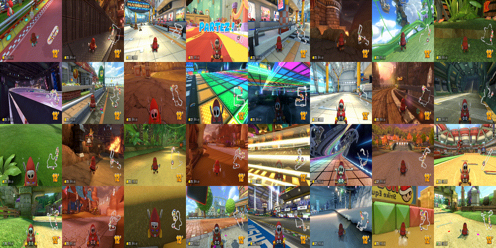
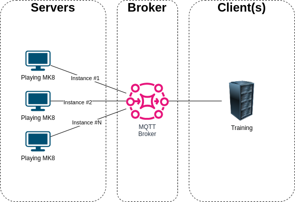
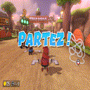

# MarioKart8-Gym-Env
A MarioKart8 OpenAI Gym environment to make reinforcement learning projects feasible. This project is intended to be used for research purposes.

This project lets you launch servals instances of Mario Kart 8 Deluxe (emulated by Yuzu) encapsulated in an OpenAI gym environment.

This allows you to train an RL agent from an RGB image with an square size of 128px.

This project can be used as a basis for adding other switch games too.

This project was completed on 03/2023 as a personal project first. I managed to train an agent that beat the hardest CPU in less than 25M steps of training.
The RL agent can be found at https://github.com/0xlouis/MarioKart8-Dreamer. The agent use an 128px RGB image as input and produce an XBox controller output.

# Architecture overview

The architecture is designed to allow great flexibility in deployment choices : It's entirely possible to run the whole thing on a single machine, but it's also possible to scale things up.



The `Servers` launch and make available the datas required for training, as well as the control vector that enabling remote control of the game. All the interactions takes places via an MQTT broker.

The `Broker` simplifies the technical set-up of remote exchanges. While providing an easy-to-interpret/debug structure.

The `Client(s)` subscribe to the broker to interact with game instances.

## File tree

Here's a quick overview of each file's purpose:
* `src/server_launcher.py` : This script is used to run a server instance forever. This is useful for training purposes, to ensure immunity against emulator crashes or internal bugs. This is the file to execute if you want to run a game instance.
* `src/server.py` : Run a game instance: configure gdb, launch yuzu with mariokart and put the game in a ready-to-play state. You should not run this file directly with python. Use `src/server_launcher.py` instead.
* `src/gym_mk8.py` : Contains the Mario Kart 8 Deluxe gym environment. The `EnvMarioKart8` class is the one you need use / costumize for your RL agent.
* `src/client.py` : Contains the lowlevel MQTT client used by the class `EnvMarioKart8`.
* `src/common.py` : Contains all the common structures (protocol, game features, etc).
* `src/platform_specific.py` : Contains interfaces for creating a fake XBox controller and provides an interface for retrieving RGB images from the game. The way to perform these two operations is very platform-specific (GNU/Linux, Windows).
* `src/joystic.py` : Used for debug. Read the state of a real controller and produce a gym action vector from this state.

# Requirement

At the time I did my training, I had :
* yuzu 1389 (2023-03-31)
* Mario Kart 8 Deluxe 1.7.1 (Fr/UE version)
* GDB for ARM with python 3.8.10 support.

I'll provide you somes hints in the `Step by step setup` section to get some of them.

## Important note about the game

Since the game's reward features are obtained by reading the state of the game at a very low level, it's important to use the same version of the game as mine (I don't know if the location changes anything). Otherwise, it's very likely that the code/memory address isn't in the same place.

If you're not able to get this exact version, or if you don't know how to update the source code to take your version into account its an "NO GO" for learning : The project will not be able to produce the reward and it will not be able to use the game menu in autonomous fashion.

# Step by step setup

In this section, I'll try to outline all the steps you need to complete to get a working application configuration.

In my case both Clients and Servers was running under an GNU/Linux system (KUbuntu 22.04.1 LTS). However, Windows is theoretically supported. For the little story, at the start of the project, the clients were running on Windows 10, because I naively thought that Windows would have a better GPU driver support for running the game. But in fact I was wrong, I got better performance on GNU/Linux. As a result, I have NEVER used Windows to train an agent and I don't know if Windows support is functional or not. I know that Windows 11 is NOT supported (because Microsoft broke their API compatibility from win10 to win11).

## Yuzu setup

### Getting Yuzu
To get the same version as mine go on the page : https://github.com/yuzu-emu/yuzu-mainline/releases/tag/mainline-0-1389 and take the `
yuzu-mainline-20230331-f047ba3bc.AppImage`

Note : In principle, you can take the latest version, unless something has been broken over time.

Now, you have to extract the content of the AppImage into a local folder :
``` bash
chmod +x yuzu-mainline-20230331-f047ba3bc.AppImage
./yuzu-mainline-20230331-f047ba3bc.AppImage --appimage-extract
```
This will create the folder `squashfs-root`. Move this folder into `emulator` and rename it to `yuzu`. At the end, the yuzu main executable should be located at `{project_root_folder}/emulator/yuzu/AppRun`. 

Run it (`./emulator/yuzu/AppRun`).

### Setup Yuzu
If you've never started up Yuzu before, you'll be asked to use your Switch for the emulator to work. In that case, go to https://yuzu-emu.org/help/quickstart/ and follow the instructions.

At this point, you should see the yuzu main windows. And your emulator is able to run Switch games.

There are additional configurations to be made, but before that, you can close the emulator and move on to the next step, which is to install Python with GDB for ARM.

## Python setup
You have to build Python to get access to it through GDB.

I used Python version 3.8.10 for this project. I recommend that you do the same. It's best to compile this version from source.

This version can be found here https://www.python.org/downloads/release/python-3810/ (direct download link: https://www.python.org/ftp/python/3.8.10/Python-3.8.10.tar.xz)

Unzip the archive into the `rsrc` folder. After the operation, there should be a directory `{project_root_folder}/rsrc/Python-3.8.10`

To compile Python from source go to `{project_root_folder}/rsrc/Python-3.8.10` and run :
``` bash
sudo apt install build-essential libssl-dev libffi-dev zlib1g-dev
./configure --enable-shared
make
make test
sudo make install
sudo ldconfig
```

At the end of the operation you should have a command `python3.8 -V` which returns `Python 3.8.10`.

You can now install dependencies with your new python version:
``` bash
python3.8 -m pip install -r requirements_server.txt
```

The next step is to install GDB for ARM with python support.

## GDB setup
The GYM MK8 environment works by retrieving the state of the emulated game by accessing the game's memory. To do this, you need GDB for ARM. For convenience, I use a toolchain (Zephyr) rather than remaking an environment from scratch.

The toolchain can be found here : https://github.com/zephyrproject-rtos/sdk-ng/releases

I advise you to use the same version as me to avoid obsolescence effects : https://github.com/zephyrproject-rtos/sdk-ng/releases/tag/v0.15.0

Download the toolchain to debug the target `aarch64`. In my case, I used : https://github.com/zephyrproject-rtos/sdk-ng/releases/download/v0.15.0/toolchain_linux-x86_64_aarch64-zephyr-elf.tar.gz

Unzip the archive into the `rsrc` folder. After the operation, there should be a directory `{project_root_folder}/rsrc/aarch64-zephyr-elf`.

The next step is to finish configuring the Yuzu emulator.

## Finilize Yuzu setup
First, run yuzu by executing `./emulator/yuzu/AppRun`.

Once Yuzu is running : you have to configure the controller. Go in the folder `rsrc/scripts/` and execute the script by this way `python3.8 plug_virtual_controller.py`

Note : You'll probably need permissions to do this. You can do the following to obtain permissions :
``` bash
sudo usermod -a -G input $USER
sudo chgrp input /dev/uinput
sudo chmod g+rwx /dev/uinput
```

In `yuzu > Emulation > Configure... > Controls` you should see an `Xbox 360 Controller 0` appear in the `Input Device` combo. The virtual controller toggle the key `B` serval time per seconds. Select it and press the `OK` dialog button. Then you can interrupt the script `plug_virtual_controller.py`.

In `yuzu > Emulation > Configure... > General > Debug` you have to enable `Enable GDB Stub` and make sure that the stub is avilable on port `6543`.

Uncheck `yuzu > View > Single Window Mode`

Uncheck `yuzu > View > Show Status Bar`

You can change other graphics settings to make sure that the game will run as fast as possible. Remember : the gym RGB resolution is 128px square at the end.

## Broker setup
For convenience, I use docker to manage the launch of the MQTT broker.
```bash
docker run -it -p 1883:1883 -v ${PWD}/rsrc/docker/mosquitto/mosquitto.conf:/mosquitto/config/mosquitto.conf --name mqtt eclipse-mosquitto
```

Note : If you want to restart it later, you can execute `docker start -i mqtt`

Note : You can use `MQTT Explorer` at http://mqtt-explorer.com/ if you want to see the broker activity.

## Prepare the game
Place your game in `xci` format in the `{project_root_folder}/game/` directory with the following name: `Mario_Kart_8_Deluxe.xci`

Make sure that your game starts correctly and that it is possible to launch a solo race.

Note : It's recommended to have the most advanced savegame possible to have access to all characters/vehicles.

## Running the server
The server depend on the following tool to work in expected way :
``` bash
sudo apt install wmctrl
```

`wmctrl` is used by the server to make sure that the game window is as small as possible (increase performance) and on top of others windows. 

Go to the `src` directory and run the following script : `python3.8 server_launcher.py`

## Running an random agent

It's possible to run the client (the one that will play with the controller) on the same machine or not, it doesn't matter as long as your MQTT broker is accessible on the network, that's the only thing that matters.

The client needs the dependencies listed in the `requirements_client.txt`.
``` bash
python3.8 -m pip install -r requirements_client.txt
```

The client doesn't depend on all the tedious previous steps. You can use another python if you like.

Once the server is running and waiting for client input, you can run your own client by executing the script :
``` bash
python3.8 gym_mk8.py
```

You should get an render of the input in an OpenCV window that look like that :



The code that produces this behavior is :
``` python
# Setup the game
game_setup = {}
game_setup['MAIN_MODE']                = common.GameSetup.MainMenu.SINGLE_PLAYER
game_setup['GAME_MODE']                = common.GameSetup.GameMode.VS_RACE
game_setup['PLAYER']                   = common.GameSetup.Player.MASKASS
game_setup['PLAYER_VARIANT']           = common.GameSetup.Player.MaskassVariant.DEFAULT
game_setup['CAR_BODY']                 = common.GameSetup.Car.Body.BIDDYBUGGY
game_setup['CAR_WHEEL']                = common.GameSetup.Car.Wheel.ROLLER
game_setup['CAR_WING']                 = common.GameSetup.Car.Wing.CLOUD_GLIDER
game_setup['RACE_RULE_MODE']           = common.GameSetup.RaceRule.Mode.CC_150
game_setup['RACE_RULE_TEAMS']          = common.GameSetup.RaceRule.Teams.NO_TEAMS
game_setup['RACE_RULE_ITEMS']          = common.GameSetup.RaceRule.Items.FRANTIC_ITEMS
game_setup['RACE_RULE_COM']            = common.GameSetup.RaceRule.COM.HARD
game_setup['RACE_RULE_COM_VEHICLES']   = common.GameSetup.RaceRule.COMVehicles.ALL
game_setup['RACE_RULE_COURSES']        = common.GameSetup.RaceRule.Courses.RANDOM
game_setup['RACE_RULE_RACE_COUNT']     = common.GameSetup.RaceRule.RaceCount.FOUR
game_setup['COURSE_CUP']               = common.GameSetup.Course.Cup.SPECIAL
game_setup['COURSE']                   = common.GameSetup.Course.Cup.Special.RAINBOW_ROAD
game_setup['MAX_STEP']                 = 3000

# When the game is reset : Change setup to choose random rules.
def callback_reset_game_setup(env):
    env.game_setup['RACE_RULE_MODE']    = random.choice([common.GameSetup.RaceRule.Mode.CC_150, common.GameSetup.RaceRule.Mode.MIRROR])
    env.game_setup['RACE_RULE_COURSES'] = common.GameSetup.RaceRule.Courses.CHOOSE
    env.game_setup['COURSE_CUP']        = random.randint(0, 11)
    env.game_setup['COURSE']            = random.randint(12, 15)

# Create env by providing MQTT address and instance ID
env = EnvMarioKart8(host="127.0.0.1", port=1883, target_instance="00000000", game_setup=game_setup, callback_reset_game_setup=callback_reset_game_setup, render_mode="human")

# print("Init controller...")
# controller = joystic.JoysticPS2("/dev/input/by-id/usb-0810_USB_Gamepad-event-joystick")
# print("Init controller... OK")

print("Reseting...")
obs, nfo = env.reset()
print("Reseting... OK")

# def human_policy(obs):
#     action = {'action': controller.to_gym()}
#     return action

def random_policy(obs):
    go_forward      = random.randint(0,1)
    go_backward     = random.randint(0,1)
    go_x_direction  = (random.random()*2)-1
    set_y_direction = (random.random()*2)-1
    look_backward   = random.randint(0,1)
    throw_horn      = random.randint(0,1)
    bump_drift      = random.randint(0,1)
    action = {'action': [go_forward, go_backward, look_backward, throw_horn, bump_drift, go_x_direction, set_y_direction]}
    return action

while True:
    # act = human_policy(obs) # The RL agent is an Human with this line.
    act = random_policy(obs) # The RL agent is an random with this line.
    # print(act)
    obs, rwd, end, nfo = env.step(act)
    # print(obs, rwd, end, nfo)
    if end:
        print("End of the episode.")
        print("Reseting...")
        env.game_setup = game_setup
        obs, nfo = env.reset()
        print("Reseting... OK")
```

# TODO

* Make a script to create a package: necessary to greatly simplify integration with OpenAI Gym (Used by my RL agent too).
